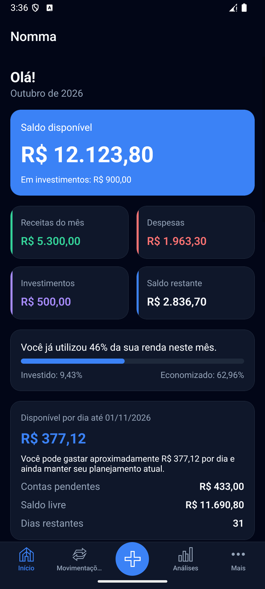
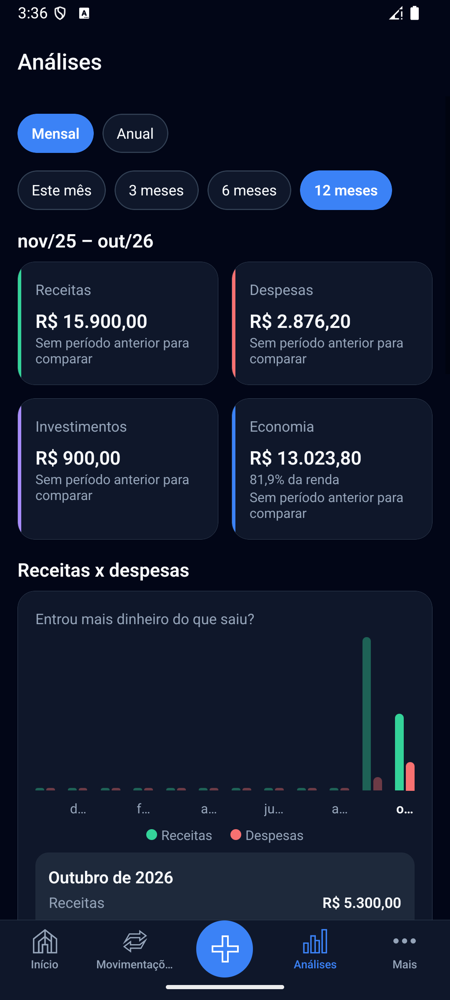
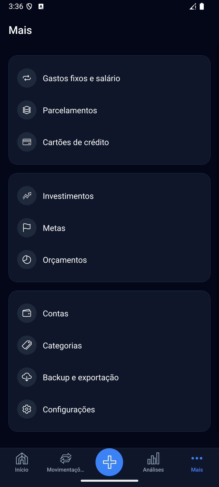

# Nomma

**Seu dinheiro, em um só lugar.**

O Nomma reúne suas finanças em um aplicativo para Android. Acompanhe o que entra e sai, organize contas e cartões e planeje suas metas com uma visão clara do seu dinheiro.

Do saldo disponível aos próximos pagamentos, tenha as informações que precisa para cuidar do seu orçamento no dia a dia — mesmo sem internet. Seus dados ficam armazenados no próprio aparelho.

[Conheça o app](#conheça-o-app) · [Comece por aqui](#comece-por-aqui) · [Execute os testes](#execute-os-testes) · [Gere o APK](#gere-o-apk) · [Documentação](#documentação)

## Conheça o app

Veja seu saldo, entenda seus gastos e acesse as ferramentas para organizar sua vida financeira.

| Visão geral | Análises | Organização |
| --- | --- | --- |
|  |  |  |

*Capturas reais do emulador Android, registradas em 01/10/2026. A interface pode evoluir nas próximas versões.*

## O que você pode fazer

- **Acompanhar seu dinheiro:** consulte saldo disponível, receitas, despesas e quanto pode gastar por dia.
- **Organizar os lançamentos:** registre movimentações e consulte o histórico por conta e categoria.
- **Planejar os pagamentos:** acompanhe gastos recorrentes, salário, parcelamentos e cartões de crédito.
- **Cuidar dos seus objetivos:** acompanhe investimentos, metas e orçamentos.
- **Entender seus hábitos:** compare receitas e despesas nas análises financeiras.
- **Levar seus dados com você:** exporte em CSV ou crie e restaure backups em JSON.

O app oferece temas claro e escuro e uma estrutura de tradução para inglês e português. A marca Nomma é a mesma em todos os idiomas. Seu slogan oficial é *Your money, in one place.*; em português, *Seu dinheiro, em um só lugar.*

## Comece por aqui

### 1. Prepare o ambiente

Para instalar as dependências e executar os testes, tenha **Git, Node.js 24.x e npm**. O teste de integração com o banco utiliza o módulo `node:sqlite`.

Para executar o aplicativo no Android, você também precisa de:

- **JDK 17** e **Android SDK com a plataforma API 36**.
- Um emulador configurado ou um aparelho com depuração USB habilitada.
- `JAVA_HOME` apontando para o JDK, `ANDROID_HOME` para o SDK e `adb` disponível no terminal.

Os scripts de geração de APK e gerenciamento do emulador deste repositório usam **Windows e PowerShell 7 (`pwsh`)**, com as ferramentas locais descritas em [Gere o APK](#gere-o-apk).

### 2. Clone o repositório

```bash
git clone https://github.com/rennancos/Nomma.git nomma
cd nomma
npm ci
```

O `npm ci` instala as versões registradas no lockfile. O banco de dados é criado ao abrir o aplicativo; não é necessário configurar um backend ou fornecer credenciais para usar as funções locais.

### 3. Abra o app no Android

Com o emulador aberto ou o aparelho conectado, execute na raiz do projeto:

```bash
npm run android
```

O comando gera o projeto Android quando necessário, compila o aplicativo, instala no dispositivo e inicia o ambiente de desenvolvimento.

Nas próximas sessões, para iniciar apenas o servidor de desenvolvimento Metro:

```bash
npm start
```

Durante o desenvolvimento, o Metro entrega o JavaScript ao app. O APK de release já inclui esse código e funciona offline, sem depender do computador.

Consulte também as instruções oficiais de [build local do Expo](https://docs.expo.dev/guides/local-app-development/).

## Execute os testes

Depois de instalar as dependências, rode os comandos na raiz do projeto:

```bash
npm run typecheck
npm run lint
npm test -- --runInBand
npm run test:sqlite
```

| Verificação | O que ela cobre |
| --- | --- |
| TypeScript | Consistência dos tipos no código |
| ESLint | Regras de qualidade e padrões do projeto |
| Jest | Regras financeiras, traduções e demais testes unitários |
| Integração SQLite | Migrations, repositórios, persistência e backups em um banco local no computador |

Para acompanhar os testes Jest enquanto desenvolve, use `npm test -- --watch`. Os resultados das validações estão documentados em [TEST_REPORT.md](docs/TEST_REPORT.md).

### Valide também no Android

Com o ambiente local preparado e o APK da versão atual gerado:

```powershell
npm run emulator
```

O script abre o emulador `Financas`, instala `builds/nomma-<versão>.apk` e inicia o app. Essa instalação preserva os dados existentes.

Para testar os fluxos pela interface, mantenha apenas um emulador de testes conectado ao adb e execute:

```powershell
npm run validate:apk
```

> **Use um emulador sem dados que precise preservar.** A automação desinstala o app, apaga seus dados e instala o APK novamente. Também ativa o modo avião, desliga Wi-Fi e dados móveis e remove os túneis `adb reverse`.

Esse teste verifica abertura do app, movimentações, saldo, persistência, navegação e registros de crash. Capturas de falhas ficam em `.android-env/tmp/`. Ao terminar, reative a conectividade do emulador se precisar dela.

## Gere o APK

O projeto possui um script de build local para Windows. Ele utiliza ferramentas em `.android-env/`, pasta que não faz parte do repositório. **Esse ambiente precisa ser preparado separadamente após o clone.**

### Prepare as ferramentas locais

```text
.android-env/
  jdk-17/       # JDK 17, com bin/java.exe
  sdk/          # Android SDK, platform-tools, build-tools e NDK
  avd/          # Emulador Financas, usado por npm run emulator
```

O ambiente usado pelo projeto inclui **SDK API 36**, **Build Tools 36.0.0** e **NDK 27.1.12297006**. O script cria as pastas de cache Gradle e arquivos temporários. Reserve a unidade virtual `G:`, usada para reduzir o tamanho dos caminhos no Windows.

O histórico e os detalhes do ambiente estão em [ANDROID_BUILD.md](docs/ANDROID_BUILD.md).

### Compile o aplicativo

```powershell
npm run build:apk
```

O script sincroniza as configurações de `app.json` com o projeto Android e compila o APK de release para celulares `arm64-v8a` e emuladores `x86_64`.

O arquivo gerado fica em:

```text
builds/nomma-<versão>.apk
```

**Cada build incrementa automaticamente a versão e o `versionCode` em `app.json`.** Se houver um emulador aberto, o script também instala e inicia o APK. O identificador Android permanece `com.rennancos.financas`.

Esse processo gera um APK local; a publicação em loja não está configurada. Consulte os detalhes da assinatura em [ANDROID_BUILD.md](docs/ANDROID_BUILD.md).

### Instale no celular

Para disponibilizar o arquivo a um celular conectado à mesma rede:

```powershell
npm run serve:apk
```

Abra no celular o endereço exibido no terminal, baixe o APK e siga as instruções de instalação do Android. Encerre o servidor com `Ctrl+C` quando terminar. Depois de instalado, o Nomma funciona sem esse servidor.

## Como o projeto é organizado

O Nomma utiliza **Expo SDK 57, React Native 0.86, React 19 e TypeScript**. A navegação usa Expo Router, os dados ficam em SQLite e o estado da aplicação é gerenciado com Zustand. React Hook Form e Zod cuidam dos formulários e da validação.

```text
src/
  app/          # Telas e navegação
  components/   # Componentes compartilhados
  database/     # Banco SQLite e migrations
  features/     # Funcionalidades do aplicativo
  i18n/         # Traduções e resolução de idioma
  services/     # Serviços e cálculos financeiros
  stores/       # Estado da aplicação
assets/         # Ícones, splash e identidade visual
docs/           # Documentação e capturas de tela
scripts/        # Build, emulador e validação do APK
```

As versões exatas e os comandos ficam em [package.json](package.json). Mantenha o [package-lock.json](package-lock.json) no Git para que outras pessoas possam reproduzir a instalação.

As pastas `android/` e `ios/` são geradas pelo Expo. As configurações nativas ficam em `app.json` e nos plugins. O `.gitignore` também exclui dependências, APKs, caches, ferramentas Android locais, arquivos de ambiente e cobertura de testes; código, assets e prints da documentação são versionados.

Referência da stack: [documentação do Expo SDK 57](https://docs.expo.dev/versions/v57.0.0/).

## Documentação

| Para saber mais sobre… | Consulte |
| --- | --- |
| Organização técnica | [Arquitetura](docs/ARCHITECTURE.md) e [banco de dados](docs/DATABASE.md) |
| Cálculos e comportamento financeiro | [Regras financeiras](docs/FINANCIAL_RULES.md) |
| Marca e idiomas | [Branding](docs/BRANDING.md) e [internacionalização](docs/I18N.md) |
| Andamento e validações | [Estado do projeto](docs/PROJECT_STATUS.md) e [relatório de testes](docs/TEST_REPORT.md) |
| Evolução do aplicativo | [Histórico de alterações](docs/CHANGELOG.md) |

Acesse o [índice completo](docs/README.md) para os demais documentos.

## Licença

Este projeto utiliza a [licença MIT](LICENSE).
