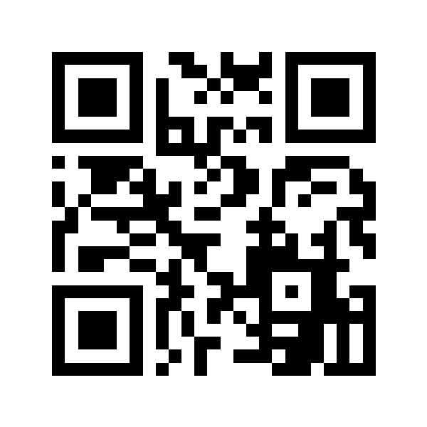

# Instalar o Finanças no celular

**Versão:** 1.0.0 (versionCode 1) · **Arquivo:** `builds/financas-1.0.0.apk` (60,4 MB) · **Android:** 7.0 ou superior

## Opção 1: QR Code (Wi-Fi)



Endereço do QR: `http://192.168.0.67:8765/`

1. No PC, dentro da pasta do projeto, rode:

   ```powershell
   npm run serve:apk
   ```

2. Conecte o celular **na mesma rede do PC**.
3. Aponte a câmera do celular para o QR Code acima.
4. Toque em **Baixar APK**. Se o Chrome avisar que o arquivo pode ser perigoso, toque em **Baixar mesmo assim**.
5. Abra o arquivo baixado e permita **Instalar apps desta fonte**.
6. Toque em **Instalar** e depois em **Abrir**.
7. No PC, pare o servidor com `Ctrl+C`. O app não precisa mais do PC.

> O QR só funciona enquanto o servidor estiver rodando e se o IP do PC continuar `192.168.0.67`.
> Se o IP mudar, gere um novo QR:
>
> ```powershell
> $env:npm_config_cache = "$PWD\.android-env\npm-cache"
> npx qrcode -o docs/qrcode-financas.png -w 600 "http://<novo-ip>:8765/"
> ```

## Opção 2: cabo USB (adb)

1. No celular: **Configurações → Sobre o telefone →** toque 7 vezes em **Número da versão**. Depois vá em **Opções do desenvolvedor →** ative **Depuração USB**.
2. Conecte o cabo e aceite a autorização que aparece no celular.
3. No PC:

   ```powershell
   .android-env\sdk\platform-tools\adb.exe devices
   .android-env\sdk\platform-tools\adb.exe install builds\financas-1.0.0.apk
   ```

## Opção 3: copiar o arquivo

Copie `builds/financas-1.0.0.apk` para o celular (cabo, Google Drive, e-mail para você mesmo), abra pelo app **Arquivos** e instale.

## Atualizar para uma versão nova

Instale o APK novo por cima do antigo (ou `adb install -r builds\financas-<versão>.apk`). **Seus dados são mantidos.**
Não desinstale antes: desinstalar apaga os dados do app. Faça um backup antes, em **Mais → Backup e exportação**.

## Problemas comuns

| Problema | Solução |
| --- | --- |
| A página não abre no celular | Confirme que o celular está na mesma rede do PC. Se o Windows perguntar, permita o Node.js no Firewall. A rede do PC está como "Pública", e nesse caso o Firewall bloqueia acessos vindos de outros aparelhos. Se não aparecer a pergunta, use a opção 2 ou 3. |
| "Instalação bloqueada" | Permita **Instalar apps desconhecidos** para o app usado no download (Chrome ou Arquivos). |
| "App não instalado" ao atualizar | O APK novo foi assinado com outra chave. Faça o backup, desinstale a versão antiga e instale a nova. |
| Play Protect avisa que o app é desconhecido | Normal para apps fora da Play Store: toque em **Instalar mesmo assim**. |

## Depois de instalar

O app funciona 100% offline: não pede internet e guarda tudo no próprio celular.
Para ver exemplos, vá em **Mais → Configurações → Carregar exemplos** (dá para remover depois).
